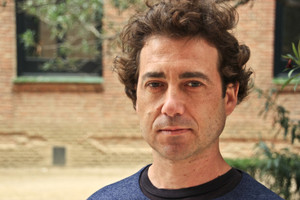

---
# Feel free to add content and custom Front Matter to this file.
# To modify the layout, see https://jekyllrb.com/docs/themes/#overriding-theme-defaults

layout: default
---

<!--  -->

I am a professor at the Universitat Politècnica de Catalunya working on various aspects of turbulence, aerospace engineering and weather and climate.

Projects:
* [Turbulencia](https://turbulencia.github.io/)
